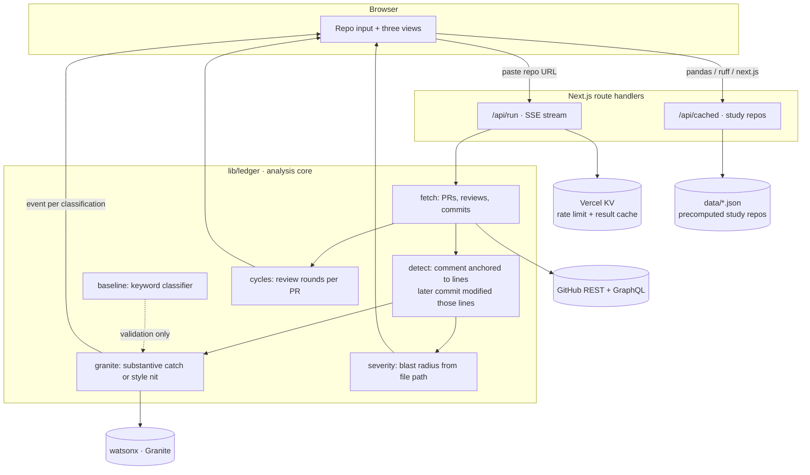

# Architecture

LEDGER counts verification work — the reviewing, correcting, and rejecting that AI-assisted development created and no dashboard records. It reads a public GitHub repository's review history, finds review comments that provably caused a code change, uses IBM Granite to separate substantive catches from style nits, and reports three things: what was prevented, how weakly output metrics predict who prevents things, and how review burden has trended over time.

Every number on screen traces to a specific review comment and a specific diff. Nothing is estimated.

---

## Flow

Two paths into the same engine. The three study repos are precomputed and load instantly, so the demo cannot fail on stage. Any other repo runs live and streams results as Granite classifies them, which proves the cached numbers were not hardcoded.

---

## What counts as a prevented event

The detector is deterministic. Granite never decides *whether* something happened, only *what kind of thing* it was.

**Deterministic precondition** — a review comment anchored to specific lines, followed by a commit that modifies those same lines before merge. The line anchor is the evidence: not "someone commented and later something changed," but "someone pointed here, and here changed."

**Granite's call** — given the comment, the code it pointed at, and the diff that followed: substantive catch, or style nit? Plus a one-line summary of what was caught.

**Severity** — blast radius from the file path. Auth, payments, migrations, and config rank above tests, docs, and fixtures. Observable from the diff, and it doubles as the anti-gaming weight: a catch in `payments/` outranks fifty nits in test fixtures automatically.

---

## The three outputs

| View | What it shows | Source |
|---|---|---|
| **Prevented-events log** | Every intervention, its severity, and a link to the exact comment and diff | detector + Granite |
| **Correlation** | Output metrics (PRs, commits) vs. prevented events, per contributor, with the rank correlation stated | detector + git history |
| **Review-cycle trend** | Review rounds per PR over time | git history only |

The correlation is reported at whatever value it comes out to. A strong negative is the inversion thesis confirmed. A flat result is still a finding — output metrics tell you nothing about who prevents problems. It is a measurement, not a demo that has to land.

---

## Validating Granite

Fifty review threads are hand-labeled by the team, blind. Three numbers get reported:

- human labels vs. Granite
- human labels vs. a keyword-only classifier (`bug`, `race`, `null`, `security` against `nit`, `typo`, `style`)
- the gap between them

If Granite beats the baseline, the model is load-bearing and we can show it. If it does not, that is reported too, and the honest finding is that the model earns its place only on ambiguous threads. Either way the claim is measured rather than asserted.

---

## What LEDGER deliberately does not claim

Three claims were cut during design because they cannot be proven from the available data:

- **That a given PR was AI-generated.** Authorship detection is unreliable. LEDGER measures verification labor and its trend over time; it never labels a PR's author.
- **What a prevented bug would have done.** The bug did not ship, so no evidence exists about its consequences. Severity is reported as observable blast radius instead.
- **Engineer-hours spent reviewing.** GitHub records timestamps, not effort, and the gap between opening and merging is mostly people sleeping. Review *cycles* are counted instead — a discrete thing that happened and can be pointed at.

Each of these had a more dramatic version. Each was dropped because it would not survive a follow-up question.

---

## Study repositories

`pandas-dev/pandas` · `astral-sh/ruff` · `vercel/next.js`

Three, not one, because a correlation from a single project is an anecdote. All three have large contributor bases where the heaviest reviewers are not the heaviest committers — the condition under which the inversion can appear at all.

---

## Runtime

Next.js and TypeScript on Vercel. One repository, one language.

- **Streaming.** The live path is a route handler returning `text/event-stream`, emitting one event per classification. Removes the serverless timeout ceiling and makes the filling log part of the demo.
- **Limits.** 50 PRs per run. Rate limited per IP via Vercel KV. Results cached per repository, so a repeat run costs no Granite calls.
- **Secrets.** GitHub and watsonx credentials are server-side only. No client ever sees a key.
- **No database, no auth, no accounts.** Cached JSON on disk for the study repos, KV for rate limiting and run results.

---

## Module ownership

The application lives in `ledger/`. Repository root stays documentation.

| Path | Built with | Contents |
|---|---|---|
| `ledger/lib/ledger/` | **IBM Bob** | `fetch.ts`, `detect.ts`, `granite.ts`, `severity.ts`, `cycles.ts`, `baseline.ts` + tests |
| `ledger/app/`, `ledger/components/` | Claude Code | UI, charts, streaming client, design system |
| `ledger/scripts/` | Claude Code | Study-repo cache builder, labeling harness |
| `ledger/data/` | generated | Precomputed study repos, hand labels |

Bob builds the analysis engine and the Granite integration — the AI core the challenge is about. `bob-log.md` records the prompts and what each produced.

---

## Design

Ledger stationery, because that is what the product is: the book nobody kept. Ruled column rules, hairline separators, ink on paper-white, tabular figures throughout, one ink accent for prevented events.

Explicitly avoided: emoji as section markers, an icon on every card, gradient heroes, identical rounded cards with colored accent bars. Charts are annotated in place rather than legended, and carry no decoration that is not data.
