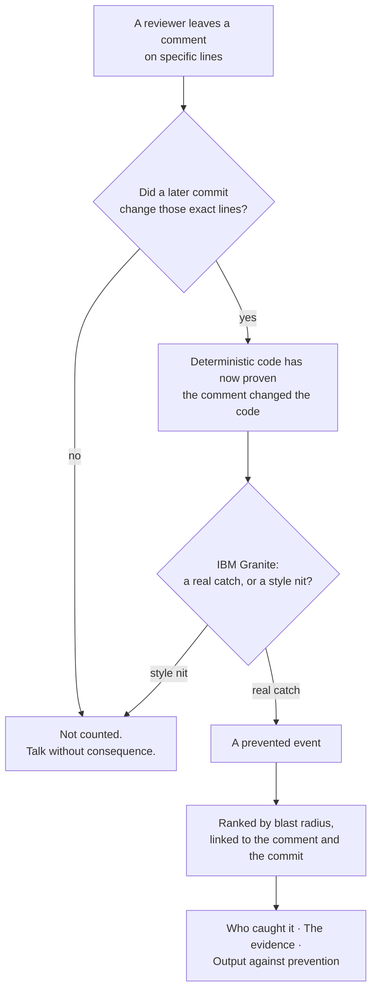

# ledger

code review analytics powered by IBM Granite

ai builders challenge via ibm skillsbuild - august challenge ("build intelligent systems for the future of work")

**Live URL in Production: https://ledger-eight-eta.vercel.app**

---

## Problem statement

AI made everyone faster at producing code. It also created a second job:
checking, correcting, and rejecting what the AI produced.

That second job is real labour. It takes hours, it falls on the most
experienced people on a team, and it appears in no metric anywhere. Developers
estimate roughly a third of the working day now goes to AI-related work
invisible to productivity tooling, and 81% of engineering leaders report review
time has risen since deploying AI. Feature-branch throughput is up 59% year over
year while median-team main-branch throughput has *fallen*.

Verification work is invisible because its product is an absence — the bug that
never shipped, the bad merge that never happened. There is nothing to point at,
so nothing gets counted.

## Why GitHub doesn't already tell you this

GitHub stores every review comment, every approval, and every commit. It
measures none of it as review.

Its contributor statistics API — the data behind the Contributors graph — returns
exactly three numbers per person:

```
GET /repos/{owner}/{repo}/stats/contributors
  → { author, total_commits, weeks: [{ a: additions, c: commits, d: deletions }] }
```

Commits, lines added, lines deleted. Nothing about review. So on the one screen
you would think to look, the people doing the catching are invisible — they
appear as low-output contributors.

That gap is the whole reason this project exists, and the correlation LEDGER
reports is the direct comparison between GitHub's ranking and one that counts
what was caught.

## Solution description

Point LEDGER at a repository and it finds **prevented events**: places where a
reviewer left a comment anchored to specific lines, and a later commit changed
those exact lines before merge. The line anchor is what makes it evidence rather
than correlation — not "someone commented and later something changed," but
"someone pointed *here*, and *here* changed."

It reports three things:

1. **Who caught it.** Prevented events per reviewer. In every repository we
   measured, a handful of people account for nearly all of them — in
   `astral-sh/ruff`, 10 of 31 contributors made every catch and the top three
   account for 88%.
2. **The evidence.** Every intervention, ranked by blast radius, each row
   linking to the actual GitHub comment and the commit that answered it.
3. **Output against prevention.** Each contributor ranked twice — by what gets
   counted, and by what got caught — with the Spearman rank correlation stated
   at whatever value it comes out to.

Three study repositories load instantly from precomputed results. Any other
public repository can be analysed live, streaming each event as Granite
classifies it.

### What we predicted, and what the data said

We expected an inversion: that careful reviewers would look unproductive on
conventional metrics. **Three independent repositories say otherwise** —
`ruff` ρ = +0.52, `pandas` ρ = +0.56, `next.js` ρ = +0.51. In large open-source
projects, maintainers both review and merge, so the same people top both
rankings. A smaller project analysed live came back at ρ = −0.19.

So the honest finding is not the one we set out to confirm: **whether careful
reviewers look unproductive depends on whether reviewing and shipping are the
same job.** What holds everywhere is the concentration — a small minority
absorbs the verification load, and nothing measures it.

We report the refutation because a measurement tool that can only confirm its
author's hypothesis is not a measurement tool.

## AI approach and architecture

**Deterministic code proves what happened. IBM Granite judges what kind of
thing it was.**

Detection is ordinary code, and has to be: the entire value of the number is
that it is trustworthy, and a language model cannot guarantee that. Parsing
unified diffs, matching a comment's line anchor against the lines a later commit
modified, ranking contributors, computing rank correlation — all deterministic
and checkable.

Granite does the part no heuristic can. Given a review comment, the file it
pointed at, and the change that followed, it decides: substantive catch, or
style nit? A heuristic sees a change request. The model reads the thread and
sees that someone noticed a retry loop with no jitter would synchronise every
caller against a rate-limited endpoint.



The split is deliberate. **Code proves what happened** — parsing diffs, matching
line anchors, ranking, correlating — because the value of a number is that it
can be trusted, and a language model cannot guarantee that. **Granite judges
what kind of thing it was**, which no heuristic can do: a heuristic sees a
change request, the model reads the thread and sees that someone caught a retry
loop with no jitter.

```
Browser
  ├── study repos ────→ /api/cached ──→ precomputed JSON
  └── any repo, live ─→ /api/run (SSE)
                            │
                            ├─ fetch     GitHub REST: PRs, review comments, commits
                            ├─ detect    line-anchored comment → lines later modified
                            ├─ granite   watsonx: substantive catch or style nit
                            ├─ severity  blast radius from file path
                            └─ stats     Spearman rank correlation
```

Astro 7 and TypeScript on Vercel, with Bun as the toolchain. The page is static
HTML plus one interactive React island. The live path streams over
`text/event-stream`, one event per classification, which removes the serverless
timeout ceiling and makes the filling log part of the demo. No database: static
JSON for the study repositories, Vercel KV for rate limiting and run caching.

### What LEDGER refuses to claim

Three claims were cut during design because the data cannot support them:

- **That a given pull request was AI-generated.** Authorship detection is
  unreliable. LEDGER measures verification labour; it never labels an author.
- **What a prevented bug would have done.** It did not ship, so no evidence
  exists about its consequences. Severity is reported as observable blast
  radius — the path it landed in — instead.
- **Engineer-hours spent reviewing.** GitHub records timestamps, not effort.

Each had a more impressive version. Each was dropped because it would not
survive a follow-up question.

## Selected challenge theme

**Wildcard Challenge — Build Intelligent Systems for the Future of Work.**

LEDGER is decision support for a question leaders are currently answering blind:
whether an AI rollout is working, and who on the team is absorbing its cost. AI
changed what work *is* — it converted a large share of engineering from
producing to verifying — and the measurement systems did not follow.

## How IBM Bob was used

**IBM Bob built the analysis engine**: every file in `ledger/lib/ledger/`
except the shared type contract. That is the AI core of the project, not its
periphery: the GitHub fetch layer, the prevented-event detector, the watsonx
Granite integration, the keyword baseline used to validate it, severity scoring,
and review-cycle counting, each with its own test suite. Every one of those
files was committed from a Bob session; the git history shows which tool wrote
what

The working pattern was context first, then implementation, then tests. Each
prompt opened by telling Bob to read `ARCHITECTURE.md` and the type contract, so
it built against an agreed interface rather than inventing one. The full prompt
log, with what each produced, is in [`ledger/bob-log.md`](ledger/bob-log.md).

**What Bob got right:** the detector. Matching a review comment's line anchor
against the hunks of a later commit requires walking unified-diff headers rather
than pattern-matching the patch text, and Bob did that correctly first time,
including the edge cases — self-review excluded, bot accounts excluded, commits
that predate the comment excluded. Its eight tests covered each condition and
its negation. On 15 real pull requests it found 42 candidates with no
adjustment.

**What had to be corrected:** two things, both found by running against the live
API rather than by reading the code.

The first was the watsonx endpoint. Bob implemented `/ml/v1/text/generation`,
which is correct for the model the plan named — but `granite-13b-instruct-v2`
has since been removed from watsonx, and its replacement is chat-tuned. Calling
text-generation returned unrelated prose. Bob switched it to `/ml/v1/text/chat`.

The second was more serious. On a long run, watsonx returned HTTP 429, and the
error path treated a rate-limited call as a *negative classification* — silently
recording "not a catch" and corrupting the data. Bob added exponential backoff
honouring `Retry-After`, so an exhausted retry is visibly distinct from a real
negative.

Both were defects that a green test suite did not catch, and both were fixed by
Bob against evidence from the live system.

---

## Running it

```bash
cd ledger
bun install
bun test lib          # 51 tests
bun run dev
```

Environment (`ledger/.env.local`):

```
WATSONX_API_KEY=
WATSONX_PROJECT_ID=
WATSONX_URL=https://us-south.ml.cloud.ibm.com
WATSONX_MODEL=ibm/granite-4-h-small
GITHUB_TOKEN=
```

Regenerate the study-repo data:

```bash
bun scripts/build-cache.ts ruff
```

---

## Team

**Anirudh Konidala** and **Harshini Bondila**

IBM SkillsBuild: AI Builders Challenge with IBM Bob Wildcard Challenge, August 2026
