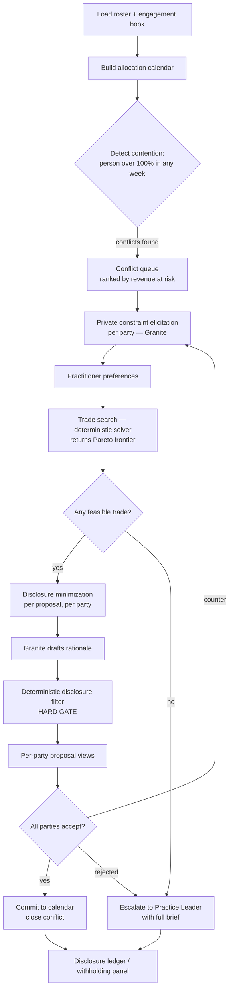
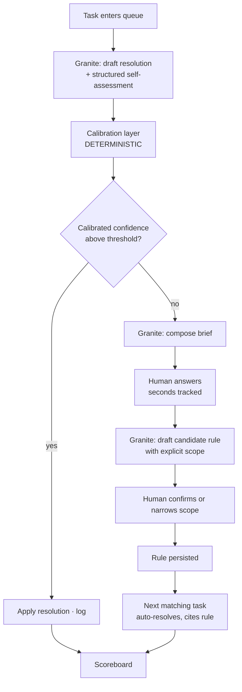
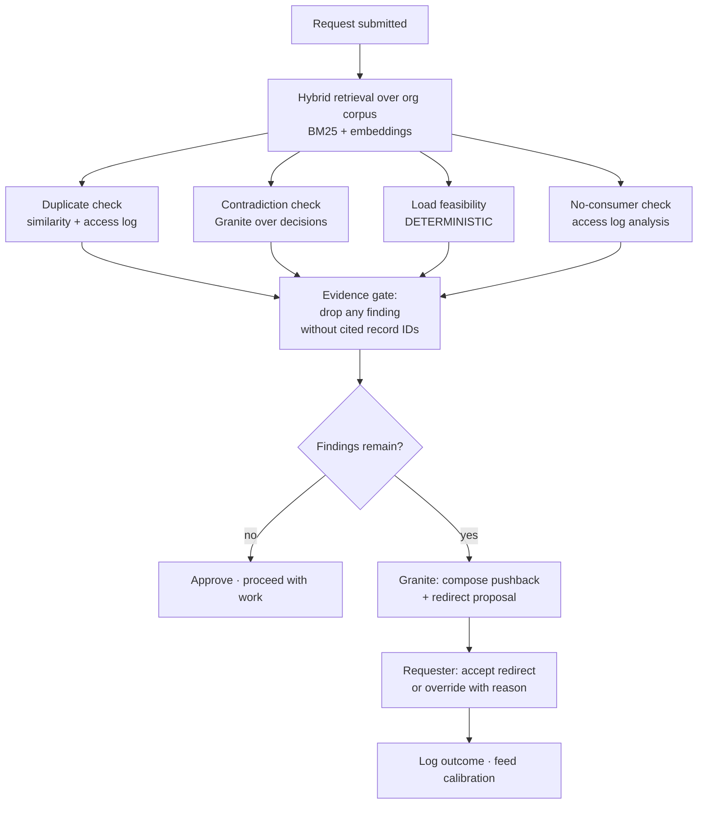
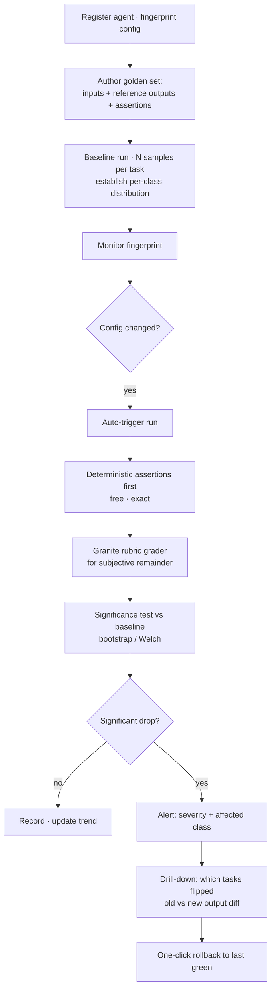

# August Wildcard — Project Notes

Notes on what to build for the IBM SkillsBuild AI Builders Challenge, August Wildcard track.

**Track:** Build Intelligent Systems for the Future of Work
**Deadline:** 31 August 2026, 11:59 PM ET
**Prizes per month:** 1st $2,250 · Runner-up $1,250 · Most Innovative $750 · Best Use of Technology $750 · plus a $5,000 Grand Prize across both months

Three parts: what the competitive field actually looks like, which ideas clear the bar and why, and how each one works end to end.

---

# Part 1 — The field

*Data pulled 2026-08-24 (day 24 of 31) from the BeMyApp platform GraphQL API, server-side tag filter, deduplicated by project ID.*

## 1. Field size — August is dramatically less crowded

| Month | Themed track | Wildcard | Total |
|---|---|---|---|
| July (final) | 275 | 79 | **354** |
| August (as of day 24) | 32 | 13 | **45** |

Prize pool is identical each month: 1st $2,250 · Runner-up $1,250 · Most Innovative $750 · Best Use of Technology $750.

August is currently at **~13% of July's volume**. Even a heavy final-week surge is unlikely to close that gap. Four prizes against a probable field of 40–80 wildcard entries is a materially better bet than July's 79, and far better than July Creative's 275.

**Implication:** August Wildcard is the correct track. August Space (32 entries) is both more crowded than August Wildcard and a domain where credibility is harder to establish in seven days.

---

## 2. Almost nobody uses IBM's own AI

Across all 92 wildcard projects (July + August), **6 mention watsonx or Granite in their pitch — 6.5%.**

The judging criterion reads: *"Technical Execution — quality of implementation and effective use of AI **and IBM technologies**."* This is an IBM-sponsored panel and roughly 93% of the field is quietly calling a non-IBM model.

**Implication:** Granite on watsonx as the reasoning layer, stated explicitly in the video and README, is close to free differentiation — and it is the single clearest path to **Best Use of Technology**, the prize with the smallest effective field.

---

## 3. Crowding map (92 wildcard entries, keyword-clustered)

### Death zones — avoid

| Cluster | Count | Representative entries |
|---|---|---|
| Meeting / knowledge capture | 12 | AncoraAI, Cadence, MindMesh, Atlas, Corpus |
| Student / career assistants | 10 | CareerPlot AI, Nexus AI, Acad-Nav, Student Digital Twin, ClearPath AI, FocusForge |
| Generic "decision intelligence platform" | 10 | Cascade Intelligence, NexusFlow, AI ICF Copilot, AutoSage |
| Multi-agent orchestrator (unspecified) | 10 | Chronos, ARL, OpsFlow, VoxDesk, Intently |

### Getting crowded

| Cluster | Count | Representative entries |
|---|---|---|
| Governance / audit / trust / compliance | 6 | Mandate, SENTRY AI, Decision Assurance Layer, Trace, Catalyst Integrity Desk, vane-guard |
| Offline / local / air-gapped | 5 | Astartis, Netwroxia, MeshNet-AI |

### Known siblings to watch

- **Shadow Ops** (July) — *"AI preflight platform that finds hidden work, measures AI Tax, and designs safer workflows."* Closest existing entry to any "find and eliminate waste work" concept. Not present in the August field, but the framing is no longer novel.
- **Beef** (July) — *"Finds pairs of open PRs that pass every check alone but break each other when merged."* Occupies pairwise-interference detection.
- **Mandate** (July) — *"A policy-to-permission control plane for AI agents."* Occupies agent permissioning (not competence boundaries).
- **MetaForge** (August) — *"Turns rough AI-worker ideas into scoped, testable, exportable system prompts."* Adjacent to agent-quality tooling, but authoring-time rather than runtime.
- **RESONANCE** (August) — *"Turns organizational history into intelligence to recognize patterns before they repeat."* Occupies institutional-memory framing.

---

## 4. What separates the sharp entries

The standouts are **narrow and falsifiable**, not broad platforms:

> **Beef** — "Finds pairs of open pull requests that pass every check alone but break each other when merged."

One sentence. Obviously a real problem. Provably works or doesn't.

> **Project Naur** — "An MCP-driven ontological linter using Bob to enforce a shared mental model before teams code."

Meanwhile 60+ entries reduce to *"AI-powered platform for [broad category]."* Those are indistinguishable inside a three-minute video, and they lose Innovation and Real-World Impact simultaneously.

**Pattern: one weird specific problem, provably solved, beats one big vague problem, plausibly addressed.**

---

## 5. The universal gap — nobody proves anything

Across all 92 entries, essentially none present a benchmark, a measured before/after, a real user, or an evaluation harness. Every entry *claims* outcomes. None *demonstrate* them.

**Implication:** the cheapest available edge is measurement. A golden test set, a stated baseline, and one honest number on screen. In a field of unverified claims, a single verified number is disproportionately persuasive — and it is the only direct evidence a judge can use to score Real-World Impact.

---

## 6. Strategic conclusions

1. **Submit to August Wildcard.** Smallest field, same prize pool, one-shot opportunity (we have not used our wildcard).
2. **Use Granite on watsonx** as the reasoning layer, and say so explicitly. ~6% of the field does this.
3. **Pick a narrow, falsifiable problem.** Avoid the four death zones entirely.
4. **Measure something and put the number in the video.** This is the field's blind spot.
5. **Treat `docs/bob-log.md` as a scored deliverable.** "How IBM Bob was used" is a required README section; most teams will write three sentences for it.
6. **Budget a full day for the video.** Judges score the video, not the repository.

---

## Method note

The projects listing requires no authentication, but its paginated listing is unstable — an unfiltered sweep returned only 372 of a claimed 802 records with duplicates across pages. Counts in this document come from **per-tag filtered queries** run to exhaustion and deduplicated by `_id`, which return consistent, complete results. The platform's `total: 802` field is unfiltered and should be ignored when reading per-tag counts.

Reproduce by POSTing the `GetOthersProjectList` operation to `/graphql/graph/graphql` with `filters.tags = [<tagId>]`. Tag IDs:

| Tag | ID |
|---|---|
| July Creative Industries Challenge | `6a1f467dc765ca54b71c49db` |
| Wildcard Challenge (July) | `6a44179ecce72a17f06c9ace` |
| August Space Exploration Challenge | `6a70b67833a12697f185beb8` |
| Wildcard Challenge (August) | `6a70b67833a12697f185beb9` |

---

---

# Part 2 — The ideas

## Selection filter

Every idea below had to clear five gates. These come directly from the landscape analysis, not from taste.

| Gate | Why |
|---|---|
| **Real business problem, with a cost** | "Real-World Impact" is a scored criterion. A problem with a dollar figure attached beats a problem with a persona attached. |
| **IBM has this problem** | The judging panel is IBM employees. A pain they personally feel converts an abstract score into recognition. Weighted, not required. |
| **Unoccupied in the field** | 4 clusters are saturated (see landscape §3). Entering one caps Innovation regardless of execution. |
| **Narrow and falsifiable** | The sharp entries are one-sentence problems (Beef, Project Naur). Broad platforms are indistinguishable in a 3-minute video. |
| **Measurable in 7 days** | Nobody in the field proves anything (landscape §5). One honest number is the cheapest available edge. |

Two things apply to **every** idea here and are not repeated below: Granite on watsonx as the reasoning layer (~6% of the field does this), and `docs/bob-log.md` treated as a scored deliverable.

---

# TIER 1

## 1. BENCH — staffing conflict as multi-party negotiation

> Two engagements need the same person. Both have real deadlines. Both have hidden flexibility neither will volunteer. BENCH finds the trade.

### The business problem

Professional-services firms live or die on utilization. Every consultancy runs some version of a weekly staffing call where partners argue over the same scarce specialists, and the outcome is decided by whoever escalates hardest — not by what's globally optimal. The losses are real and quantifiable: bench time on one side, delivery slip on the other, and attrition when people are repeatedly assigned against their stated growth interests.

The structural reason this stays broken: **the information needed to find a good trade is private and nobody is incentivized to reveal it.** Engagement A won't admit its deadline has two weeks of float, because that float is its negotiating leverage. So the trade that would have made both sides better off never surfaces.

### Why IBM specifically

IBM Consulting is one of the largest professional-services organizations on earth — on the order of 160,000 practitioners matched to engagements continuously. Skills-to-demand matching at that scale is not a hypothetical IBM problem; it is a core operational constraint of a major IBM business unit. A judge from IBM Consulting will recognize this within ten seconds of the demo.

It also generalizes cleanly — every agency, hospital scheduling office, and university course-assignment committee has the same shape.

### Why this wins — rationale

**Whitespace.** Across all 92 wildcard entries, *every single one is a single-user tool.* Not one mediates between multiple people with genuinely conflicting interests. This is the largest unoccupied territory in the field, and it is the most literal possible reading of the challenge statement's "help **teams** achieve outcomes faster."

**The innovation is the privacy model, not the matching.** Constraint solvers are old. What's new: BENCH holds each party's private constraints, computes trades using information *neither party can see*, and discloses only the minimum needed to make the trade acceptable. It is a mediator that knows more than either side and is trusted precisely because it demonstrably withholds. That's a genuinely novel framing for an "AI coworker" and it's defensible under judge questioning.

**It demos better than anything else on this slate.** Human conflict, visible stakes, a resolution nobody at the table had spotted. Three minutes is plenty.

**It contains the escalation mechanic** from idea #2 for free: when no Pareto-improving trade exists, BENCH escalates with a full brief instead of forcing a bad answer.

### What gets measured

Seed a realistic conflict set (~40 staffing conflicts with known-optimal solutions).

- **Joint utility gain** vs. first-come-first-served baseline — the headline number
- **Resolution rate without human escalation**
- **Information leakage audit: zero unauthorized disclosures**, mechanically verified

That third one is the killer. A live panel showing *what the system knew and deliberately did not say* is the most memorable ten seconds available in this entire field.

### Demo beat (3 min)

1. Three-way conflict on screen. Two engagement leads, one specialist, both deadlines real.
2. Each party privately states constraints, including flexibility they'd never say out loud.
3. BENCH proposes a trade — swap the specialist for weeks 1–2, backfill with a named alternate, engagement B slips a non-critical workstream into its float.
4. Both accept. Joint utility up 34% over baseline.
5. **The withholding panel:** here is what BENCH knew about each side and never revealed.
6. Fourth conflict has no valid trade → escalates with a complete brief rather than forcing it.

### Architecture

Deterministic constraint solver proposes candidate trades (plain Python — this must be provably correct, not vibes). Granite handles constraint elicitation from natural language, trade rationale generation, and the disclosure-minimization judgment. Next.js front end. The split matters: the solver guarantees correctness, Granite provides the human interface, and you can say that out loud as an engineering decision.

### Feasibility: **High.** Solver is a day. Elicitation and rationale are Granite calls. The UI is the bulk of it.

### Risks

Scope creep toward "a full staffing platform." Resist — one conflict type, three parties, done. If the constraint model gets too rich the solver stops being explainable, which kills the whole trust argument.

---

## 2. RELAY — escalation as a first-class primitive

> Agents don't fail because they're weak. They fail because they don't know when to stop.

### The business problem

The blocker to deploying AI agents on real work isn't capability — it's that a competent-95%-of-the-time agent that is *confidently wrong* the other 5% is worse than useless in any process with consequences. Current systems either guess (silent errors that surface downstream, expensively) or dump the whole task on a human with no context (which destroys the time savings that justified the agent).

Both failure modes have the same root cause: **the handoff is not a designed object.** Escalation is an afterthought — a fallback branch, not a product surface.

### Why IBM specifically

IBM's entire enterprise AI positioning is trustworthy AI in regulated industries — finance, healthcare, government. In exactly those industries, "the agent guessed" is not a bug report, it's a compliance incident. The unsolved problem standing between watsonx agents and production deployment in a bank is precisely this one. An IBM judge selling into regulated accounts has heard this objection from every client.

### Why this wins — rationale

**Clean whitespace, verified.** Zero of 92 entries treat handoff as the product. The nearest neighbor is *Mandate* ("policy-to-permission control plane"), which governs what an agent is *allowed* to do — an authorization question. RELAY governs what an agent is *competent* to do, which is an epistemics question. Different axis, and the distinction is easy to articulate when a judge asks how you differ.

**It answers the challenge statement's exact language.** "AI is evolving from a productivity tool into a true collaborator." A collaborator's defining trait is knowing the edge of their own competence. This is the most rigorous available interpretation of that sentence, and Challenge Fit is a scored criterion.

**The metric is unusually strong.** "Confidently wrong rate: baseline 23% → RELAY 4%" is a real number, adversarially checkable, and *nobody else in the field will have one like it.*

**Learning loop closes it.** A human's resolution is captured as a durable constraint, so the same class of ambiguity resolves automatically next time. That converts a one-shot tool into a system that improves — a much stronger Feasibility story.

### What gets measured

Labeled task set (~60 tasks, ~20 genuinely ambiguous).

- **Confidently-wrong rate** — baseline agent vs. RELAY. Headline.
- **Escalation precision/recall** — does it escalate the right things, or panic-escalate everything? (The trivial cheat is escalating always; measuring precision proves you didn't.)
- **Human seconds per escalation** — proof the context brief actually works
- **Repeat-ambiguity auto-resolution rate** — proof the learning loop closes

### Demo beat (3 min)

1. Agent works a queue of ops tasks. Fast, clean, unremarkable.
2. Task 7 is ambiguous. Baseline agent guesses — wrong, and shows the downstream damage.
3. RELAY on the same task: stops, packages a brief (what I tried · what I know · what I need · two options with tradeoffs · my recommendation).
4. Human answers in 8 seconds.
5. Task 12 is the same class of ambiguity → auto-resolved from the learned constraint.
6. Scoreboard: confidently-wrong 23% → 4%.

### Architecture

Granite generates the task attempt *and* a structured self-assessment of what it's uncertain about. A calibration layer (deterministic, tuned on the labeled set) converts that into an escalate/proceed decision — do not let the model grade its own homework unsupervised, and say so. Brief generation and constraint absorption are Granite. Constraints persist as retrievable rules.

### Feasibility: **High.** The labeled task set is the real work — budget a full day to build it honestly. Everything else is straightforward.

### Risks

Calibration is genuinely hard; an uncalibrated confidence score makes the headline metric meaningless. Mitigate by tuning against the labeled set and *reporting the calibration curve* — showing the curve turns a weakness into a Technical Execution point.

---

## 3. SPINE — the AI coworker that pushes back

> Every entry in this hackathon builds an agent that says yes. Collaborators say no.

### The business problem

Organizational waste is overwhelmingly generated at the *request* layer, not the execution layer. Work gets commissioned that duplicates work already done, that contradicts a decision made three weeks ago, that is infeasible given the requester's own committed load, or that nobody will ever read. Compliant tooling — including every AI assistant currently shipping — accelerates all of it. Making bad work faster is negative value, and it's the default outcome of deploying an eager assistant into a dysfunctional process.

The human who would catch these is a senior person with full context and enough standing to push back. Most organizations have too few of them, and they're the bottleneck.

### Why IBM specifically

Weaker direct tie than #1 or #2 — this is an every-large-organization problem rather than a distinctively IBM one. It applies to IBM at 270,000+ employees as much as anywhere. Include it for its Innovation ceiling, not its IBM alignment.

### Why this wins — rationale

**It inverts the premise the entire field shares.** All 92 entries assume the AI's job is to do more. SPINE's job is to refuse. A judge scoring their fortieth submission of the day will remember exactly one thing about the wildcard track, and it will be the one that said no.

**It's honest about a real failure mode of this whole product category** — which reads as maturity rather than cynicism, and gives you a strong answer to "what are the limitations of your approach?"

**Sharp, symmetric metric.** Pushback precision *and* false-pushback rate. The false-pushback number is what makes it credible: an agent that refuses everything is trivially "safe" and completely useless, and measuring both proves you understand that.

### What gets measured

Seeded request set (~40 requests, 15 of which are genuinely bad, each bad one bad for a *different* reason: duplicate, contradicts prior decision, infeasible load, no consumer).

- **Pushback precision / recall** by failure category
- **False-pushback rate** — the credibility number
- **Estimated hours saved** from prevented work

### Demo beat (3 min)

1. Request comes in: "Build a weekly churn dashboard for the retention team."
2. Baseline assistant: enthusiastically starts building.
3. SPINE: *"This duplicates the retention dashboard shipped in March — here it is, and its access log shows 4 views in 60 days. The underlying question looks like [X]. Want that instead?"*
4. Second request — SPINE approves it immediately and gets to work. **This beat is essential:** it proves the system isn't a blanket refuser.
5. Third: *"This contradicts the 12 August architecture decision. Escalating to the decision owner rather than proceeding."*
6. Scoreboard: 13/15 bad requests caught, 1 false pushback out of 25 good ones.

### Architecture

Retrieval over an org corpus (prior decisions, shipped artifacts, access logs, current commitments). Granite performs the four-category conflict classification with mandatory evidence citation — **every pushback must cite the specific record that justifies it**, which is what separates this from an LLM being contrarian. Deterministic checks handle load feasibility.

### Feasibility: **Medium-high.** The seeded corpus is the work; the logic is comparatively simple.

### Risks

Tonally, this can read as obnoxious. The demo must show it being *helpful* while refusing — always redirect to the better version of the request, never just decline. Beat 4 is not optional.

---

## 4. WARD — regression detection for deployed AI coworkers

> You changed a prompt. Something got 14% worse. Nobody will notice for three weeks.

### The business problem

Organizations are deploying agents into real workflows right now. Those agents get modified constantly — prompt edits, model version bumps, tool changes, retrieval index updates. Every one of those is an untested deploy to production.

Traditional software has a hundred years of accumulated practice for this: tests, CI, canaries, rollback. Agent deployments have essentially none. Quality degrades silently and is discovered through downstream business damage, which is the most expensive possible detection mechanism.

### Why IBM specifically

IBM sells agent platforms to enterprises and runs them internally. Every client deploying watsonx agents will hit this within two quarters. Note the adjacency risk honestly: **watsonx.governance** already covers policy compliance, audit trails, and drift monitoring. WARD must be positioned as the *functional-quality* layer — "did the agent do the job correctly," a testing concern — not the governance layer. Framed as complementary this is strong; framed carelessly it looks like a worse version of a shipping IBM product.

### Why this wins — rationale

**Directly exploits the field's blind spot.** Landscape §5: nobody measures anything. WARD's entire product *is* measurement, which makes the Technical Execution case almost self-proving.

**Meta-resonance with the judges.** IBM engineers ship AI systems for a living. This is a problem they have personally been bitten by, which is worth more than any framing exercise.

**Unambiguously demonstrable.** Inject a known regression, show it caught, show the diff identifying which task class broke. There is no hand-waving available — it either catches it or it doesn't.

**Nearest neighbor is authoring-time, not runtime.** *MetaForge* (August) scopes and tests prompts at design time. WARD watches deployed agents over time. Adjacent, clearly distinct.

### What gets measured

- **Regression detection rate** at varying severities (2%, 5%, 15% quality drops)
- **False alarm rate** under normal output variance — the hard part, and the credibility number
- **Time-to-detection** vs. a downstream-damage baseline

### Demo beat (3 min)

1. Three agents in production, quality scorecards green.
2. Engineer makes a harmless-looking prompt edit.
3. WARD runs the golden set. Overall quality −14%, alert fires.
4. Drill down: the regression is isolated to one task class — multi-step refunds.
5. One-click rollback, scorecard green.
6. Detection: 4 minutes. Baseline (customer complaints): 3 weeks.

### Architecture

Golden task sets with reference outputs. Granite as grader with a **calibrated rubric**, cross-checked against deterministic assertions wherever the output is checkable — never let an ungrounded LLM judge be the only signal, and say so explicitly. Statistical significance testing to separate real regressions from noise (this is what makes the false-alarm rate defensible).

### Feasibility: **Medium.** Statistical layer needs care. Heaviest Tier 1 build.

### Risks

Least human of the four — it's infrastructure, and infrastructure demos are cold. Needs a strong narrative frame ("the three weeks nobody noticed") to carry emotionally.

---

# TIER 2 — strong ideas, worse fit for a 7-day window

## 5. KEEL — extracting tacit knowledge from legacy systems

**Problem.** Critical systems are maintained by people who are retiring. The documentation describes what the code does; the irreplaceable knowledge is *why* — why this validation exists, which client demanded it, what breaks if you remove it. That knowledge leaves the building permanently.

**IBM tie: the strongest on this slate.** Mainframe and COBOL modernization is a major IBM business line, and workforce attrition in that estate is a well-documented, openly-discussed industry crisis. IBM ships watsonx Code Assistant for Z specifically into this problem.

**Why it's Tier 2.** A credible demo needs a legacy codebase *and* a plausible institutional history around it. Synthesizing both convincingly in seven days is a stretch, and an unconvincing one undermines the entire premise. Also brushes against *RESONANCE* (August), which occupies the organizational-memory framing.

**Promote it if** you have real access to a legacy system with genuine institutional history. That access would be a decisive unfair advantage.

## 6. TWIN — simulate the process change before you make it

**Problem.** Organizations restructure processes and deploy automation based on argument, not evidence. The failure shows up in production, at full cost. Simulating the change first — agents playing each role against historical data, surfacing where it queues, breaks, or costs more — turns a guess into a test.

**Why it's Tier 2.** Highest technical ceiling on the slate and the strongest possible Technical Execution story, but it is comfortably a three-week build. Attempting it in seven days produces a shallow version that reads as a toy, which is worse than a deep version of a smaller idea.

**Promote it only if** the team is 4–5 people who can genuinely parallelize.

---

# Recommendation

**Build BENCH.** Rationale, in priority order:

1. **Largest verified whitespace.** All 92 entries are single-user tools. Multi-party mediation is unoccupied, and it's the most literal reading of the challenge statement.
2. **Strongest business problem with the strongest IBM tie.** Staffing-to-demand matching is a core operational constraint of IBM Consulting — recognizable to a judge in seconds, and dollar-denominated rather than persona-denominated.
3. **Best three-minute demo on the slate.** Human conflict, visible stakes, a resolution nobody spotted. The withholding panel is the most memorable single beat available in this field.
4. **Highest feasibility in Tier 1.** Deterministic solver plus Granite elicitation. No calibration research required, unlike RELAY and WARD.
5. **It absorbs the other ideas' best mechanics.** RELAY's escalation is BENCH's no-valid-trade path. SPINE's evidence-cited pushback is how BENCH rejects an unreasonable constraint.

**Fallback: RELAY**, if the team is smaller than three. It's cleaner whitespace and a simpler build; it just demos less vividly.

**Do not build:** anything in the four death-zone clusters, regardless of how good the execution would be. Innovation is capped on entry.

---

## Open items

- [ ] Team size and available hours — gates BENCH vs. RELAY
- [ ] Any real-world access (a real staffing process, a real agent deployment, a real legacy system)? Would outweigh every ranking above.
- [ ] Claim IBM Bob — 40 Bobcoins, 30-day clock, starts on activation
- [ ] **Every team member** completes one SkillsBuild Bob activity — hard eligibility gate
- [ ] Register the project page on the platform early; don't discover a submission bug on the 31st

---


---

# Part 3 — How each one works

## A note on the architecture pattern shared by all four

Every application below splits work the same way, and the split is deliberate:

| Layer | Responsibility | Why |
|---|---|---|
| **Deterministic core** | Anything that must be *correct* — constraint solving, feasibility checks, disclosure filtering, statistical significance | These are guarantees. A language model cannot provide a guarantee, only a likelihood. |
| **Granite (watsonx)** | Anything that must be *understood or expressed* — parsing free text into structure, generating rationale, writing briefs, judging subjective quality | This is what models are actually good at. |
| **Hard gate between them** | Model output is validated against the deterministic layer before it reaches a user | "We instructed the model not to" is not a property. Enforcement in code is. |

This is worth stating explicitly in the README and the video. In a field where most entries are a model call behind a UI, showing that you know which half of your system is trustworthy is a direct Technical Execution argument.

---

# 1. BENCH

**Staffing conflict resolved as multi-party negotiation with enforced information asymmetry.**

## What it is, in one paragraph

Two project leads both need the same specialist during the same weeks. Each has real deadlines and each has hidden slack they will never volunteer, because that slack is their negotiating leverage. BENCH collects each party's constraints privately, searches for reallocations that make everyone better off, and presents each party only the facts they need to evaluate the proposal — provably never revealing what it wasn't authorized to share. When no acceptable trade exists, it escalates with a complete brief instead of forcing a bad answer.

## Who uses it

| Role | What they do |
|---|---|
| **Resource Manager** | Operates the system. Sees the full picture. Runs the weekly staffing call. |
| **Engagement Lead** (2+ per conflict) | States their needs privately. Receives proposals. Accepts, counters, or rejects. |
| **Practitioner** | The person being allocated. States growth interests and hard personal constraints. |
| **Practice Leader** | Receives escalations when no valid trade exists. Has broader disclosure authorization. |

## Data model

```
Person          id · skills[{name, proficiency}] · allocations[{engagement, weeks, fraction}]
                growth_interests[] · location · timezone · cost_rate

Engagement      id · client · priority_tier · revenue_at_risk
                workstreams[{required_skills, weeks, criticality}]
                hard_deadline · float_weeks (PRIVATE)

Constraint      id · owner · type(hard|soft) · weight
                visibility(private | shareable | shared)
                source_text · parsed_form

Conflict        id · person · contended_weeks · engagements[] · revenue_at_risk

Proposal        id · conflict · allocation_changes[] · joint_utility
                per_party_view[{party, deltas, rationale, disclosures[]}]

Disclosure      constraint_id · revealed_to · authorization_basis · timestamp
```

The `visibility` field on Constraint and the `Disclosure` ledger are the heart of the system. Everything else is ordinary scheduling data.

## End-to-end flow



### Step 1 — Ingest and contention detection

Load a roster and engagement book (seeded CSV/JSON). The system materializes a week-granular allocation calendar for every person. Contention detection is trivial and deterministic: any person allocated above 100% in any week is a conflict. Conflicts are grouped by person and overlapping window.

**Screen:** Conflict queue. A ranked list — *"Priya Raman · weeks 34–37 · Meridian Bank vs. Halcyon Health · $340k at risk."* Sorted by revenue at risk. The Resource Manager opens one.

### Step 2 — Private constraint elicitation

Each engagement lead gets a private intake conversation. They type naturally: *"We need Priya weeks 1 through 4, the client demo is on the 15th and she's the only one who knows their data model."*

Granite does two jobs here:

**Parse** free text into typed constraints — `requires(Priya, weeks 34-37)`, `deadline(client_demo, 2026-09-15)`, `justification(unique_knowledge, client_data_model)`.

**Probe for flexibility.** This is the part that makes the whole system work, and it's why an LLM is genuinely necessary rather than decorative. The system asks follow-ups a form never would:

> *"Is the 15th a contractual date or an internal target?"*
> *"If Priya were available weeks 36–37 only, what specifically breaks?"*
> *"Is there anyone who could shadow her on the data model in week 34?"*

Answers surface the float that would otherwise stay hidden. Each elicited constraint is recorded **private by default**. The lead sees exactly what was captured and sets visibility per item — private, shareable, or already shared. Nothing is revealed without an explicit authorization on the record.

**Screen:** Split view. Left, the conversation. Right, the live list of captured constraints with a visibility toggle on each. The lead watches their own private information being catalogued and controls it.

### Step 3 — Practitioner input

Priya states her own constraints: growth interests (*"I want more time on regulated-industry work"*), hard personal constraints (*"no travel weeks 36–37"*), and preferences. Same privacy model.

This matters beyond fairness — growth alignment is a term in the objective function, so the system optimizes for retention, not just utilization. That's a real, defensible business argument.

### Step 4 — Trade search (fully deterministic)

The solver enumerates feasible reallocations across the joint constraint set. The move set:

- **Substitution** — replace Priya with a bench resource, scored by skill adjacency
- **Partial allocation** — split her across both engagements at reduced fraction
- **Time shift** — move a workstream into declared float
- **Sequencing** — reorder workstreams within an engagement
- **Composite** — combinations of the above

Objective function is a weighted sum: deadline satisfaction, skill fit, growth alignment, utilization, and cost. The solver returns the **Pareto frontier**, not a single answer — several non-dominated options for the Resource Manager to weigh.

This is plain Python. It has to be: the entire trust argument rests on the trade being *actually feasible*, and that's a claim a language model cannot make.

### Step 5 — Disclosure minimization

**This is the novel component.** For each candidate proposal and each party, compute the minimum set of facts that party must learn to evaluate it.

The procedure:

1. The proposal changes party P's allocation. P must see their own delta — always authorized, it's their own data.
2. P needs enough justification to accept. Candidate justifications are drawn from the constraint set.
3. Filter candidates to those P is authorized to see (either P owns them, or the owner marked them shareable).
4. Select the **minimum subset** sufficient to justify the change.
5. Granite drafts human-readable rationale from that subset only.
6. **Hard gate:** a deterministic filter parses the drafted rationale and checks every factual claim against the authorized subset. Any sentence citing or implying a private constraint is rejected and regenerated. If regeneration fails twice, the proposal is presented without rationale rather than with a leaky one.

Step 6 is why this is a security property and not a prompt. Say that out loud in the video.

### Step 6 — Proposal presentation

Each party sees **their own view only**:

> **Meridian Bank engagement lead sees:**
> Priya moves to 50% weeks 34–35, full time 36–37. Marcus Chen covers the data-model workstream weeks 34–35 — he shipped the equivalent model at Northwind last quarter. Your 15 September demo date is unaffected.
> *Joint utility for this option: +34% over first-come-first-served.*

Note what's absent: no mention that Halcyon disclosed two weeks of float. That fact drove the entire solution and Meridian never learns it.

The Resource Manager sees the full picture and the frontier.

### Step 7 — Accept, counter, or reject

Counters are captured as new constraints and the solver re-runs. Each round is logged.

### Step 8 — The no-valid-trade path

When the Pareto frontier is empty, or every option is rejected, BENCH escalates rather than forcing an answer. The Practice Leader receives:

- The conflict and what's at stake
- The constraint set, respecting privacy (the escalation target has broader authorization, so they see more — but the ledger records exactly what and why)
- Every option tried and the specific reason each failed
- The two least-bad options with explicit tradeoffs
- A recommendation, and an honest statement of what makes it uncertain

This is the RELAY mechanic embedded in BENCH — the system knows the edge of its own competence.

### Step 9 — The withholding panel

An audit view, and the most memorable ten seconds of the demo:

> **Constraints held:** 14 · **Revealed:** 3 · **Unauthorized disclosures:** 0
>
> | Fact | Held from | Would have changed their position | Authorization |
> |---|---|---|---|
> | Halcyon has 2 weeks float | Meridian | Yes — they'd have demanded all 4 weeks | Never-share (owner: Halcyon) |
> | Meridian's demo is internal, not contractual | Halcyon | Yes | Never-share (owner: Meridian) |
> | Priya prefers regulated-industry work | Both | No | Shareable, but not needed |

Every row is a fact the system used to find the trade and deliberately did not say. This is the product.

### Step 10 — Commit

Accepted proposal writes back to the allocation calendar. Conflict closes. Downstream conflicts recompute.

## What Granite does, precisely

1. Free-text → typed constraints
2. Flexibility-probing follow-up questions
3. Proposal rationale drafting (from the authorized subset only)
4. Escalation brief composition

## What is deterministic

1. Contention detection
2. Trade search and Pareto frontier
3. Disclosure authorization filtering (the hard gate)
4. Joint utility computation

## Evaluation harness

Forty seeded conflicts with computed optimal joint utility.

| Metric | Baseline | Target |
|---|---|---|
| Joint utility vs. optimal | FCFS: ~55%<br/>Seniority-wins: ~62% | 85%+ |
| Resolved without escalation | n/a | 70%+ |
| **Unauthorized disclosures** | n/a | **0, asserted in tests** |

The leakage metric is a hard assertion in the test suite, not a measured average. A single leak fails the build. That framing is the difference between a claim and a guarantee.

## Build estimate

| Component | Days |
|---|---|
| Data model + seed generator | 1 |
| Solver + Pareto | 1 |
| Granite elicitation + rationale | 1 |
| Disclosure filter + ledger | 1 |
| UI (queue, intake, proposal, withholding panel) | 2 |
| Eval harness + video | 1 |

---

# 2. RELAY

**Agents that know the edge of their own competence, and hand off well when they reach it.**

## What it is, in one paragraph

An agent works a queue of real tasks. On most it just works. On the ambiguous ones it stops — not because it failed, but because a calibrated confidence estimate says it shouldn't guess. It packages what it tried, what it knows, exactly what it's missing, and the options with tradeoffs, then routes to a human. The human answers in seconds. That answer becomes a durable, scoped rule, so the next task of the same shape resolves automatically.

## Who uses it

| Role | What they do |
|---|---|
| **Ops worker** | Receives escalations, answers the specific question, confirms rule scope |
| **Agent operator** | Configures thresholds, reviews the calibration curve, audits learned rules |

## Demo domain

Customer support ticket resolution under a policy document — concrete, legible in 30 seconds, and genuinely ambiguous in realistic ways (refund thresholds, tenure exceptions, edge cases the policy doesn't cover).

## Data model

```
Task            id · payload · ground_truth (eval only) · ambiguity_label (eval only)

Attempt         task · draft_resolution · self_assessment{
                  missing_facts[] · ambiguous_clauses[] · assumptions_made[]
                  per_dimension_confidence{}
                } · retrieval_coverage

Decision        attempt · calibrated_score · action(escalate|proceed) · threshold_used

Brief           attempt · tried · known[{claim, cited_source}] · needed
                options[{action, consequence}] · recommendation · uncertainty_statement

Resolution      brief · human_answer · human_rationale · seconds_to_resolve

Rule            pattern · policy · scope · provenance(resolution_id) · confirmed_by
```

## End-to-end flow



### Step 1 — Attempt with structured self-assessment

Granite receives the task and the relevant policy context, and produces two things: a draft resolution, and a **structured uncertainty report** — which facts it couldn't find, which policy clauses were ambiguous as applied, which assumptions it had to make, and per-dimension confidence.

Asking for the uncertainty report as structured output rather than a number is deliberate. "Confidence: 0.7" is nearly meaningless. "I could not determine customer tenure, and clause 4.2 doesn't specify behavior for partial refunds" is actionable, and it becomes the raw material for the brief.

### Step 2 — Calibration layer (deterministic)

**The model does not decide whether to escalate.** A calibrated function of its signals decides.

Features: the self-assessment dimensions, retrieval coverage (did we actually find relevant policy?), task-shape features, and historical accuracy on similar tasks. These map to a calibrated probability of correctness via isotonic regression fitted on the labeled set. A threshold on that probability produces the escalate/proceed decision.

This matters for two reasons. Raw model self-confidence is systematically overconfident and unusable as-is. And separating the *signal* from the *decision* means the threshold becomes a tunable business parameter — a bank sets it conservatively, a low-stakes internal tool sets it loose. That's a real deployment story.

### Step 3 — Proceed path

Resolution applied and logged with its confidence score, so post-hoc auditing can check whether the threshold is set correctly.

### Step 4 — The brief

Escalation quality is the whole product. A bad handoff ("I couldn't do this, here's the ticket") destroys the time savings that justified the agent. The brief has a fixed structure:

> **What I tried** — draft resolution, with reasoning
> **What I know** — retrieved facts, each citing its source record
> **What I need** — *one* specific question, not a list of ten
> **Options** — each with its consequence
> **My recommendation** — and an honest statement of what makes me unsure

The single-question constraint is enforced. An agent that asks five questions has moved the work to the human rather than reducing it.

**Screen:** The brief renders as a card. The human's answer is usually one click or one short sentence. Time-to-resolution is tracked and displayed, because it's a headline metric.

### Step 5 — Constraint absorption, with scope confirmation

Granite converts the human's answer and rationale into a candidate rule with an **explicit scope**:

> *"When refund amount > $500 AND customer tenure < 90 days → require manager approval."*
> Derived from your resolution of ticket #4471. **Is this the right scope?**
> `[Confirm] [Narrow] [Just this once]`

The scope confirmation is not a nicety. Over-generalizing from a single human decision is exactly how these systems poison themselves — one answer about one edge case silently becomes policy for a thousand unrelated tasks. Making the human confirm the boundary is the difference between a system that learns and a system that drifts.

### Step 6 — Replay

The next task matching the rule resolves automatically, citing the rule and its provenance. The audit trail runs all the way back to the human decision that created it.

### Step 7 — Scoreboard and calibration curve

Live metrics, plus a **reliability diagram** — predicted confidence against observed accuracy, ideally on the diagonal.

Showing the calibration curve is the strongest single Technical Execution move available in this project. It demonstrates you understand that a confidence number is a claim requiring validation, and it preempts the sharpest question a judge can ask.

## Evaluation harness

Sixty tasks, twenty genuinely ambiguous. Baseline is the same Granite agent with escalation disabled.

| Metric | Baseline | Target |
|---|---|---|
| **Confidently-wrong rate** | ~23% | <5% |
| Escalation precision | n/a | >80% |
| Escalation recall | n/a | >85% |
| Mean human seconds per escalation | n/a | <15s |
| Repeat-ambiguity auto-resolution | 0% | >70% |

Precision matters as much as recall. Escalating everything trivially achieves zero confidently-wrong answers and is completely useless — reporting both proves the system isn't cheating.

## Build estimate

| Component | Days |
|---|---|
| Labeled task set (the real work — do it honestly) | 1.5 |
| Granite attempt + self-assessment | 0.5 |
| Calibration layer + curve | 1 |
| Brief generation + resolution UI | 1.5 |
| Rule absorption + replay | 1 |
| Scoreboard + video | 1 |

---

# 3. SPINE

**An AI coworker that refuses work it can prove shouldn't be done.**

## What it is, in one paragraph

Work requests arrive. SPINE checks each one against what the organization has already built, already decided, and already committed to. When a request duplicates shipped work nobody uses, contradicts a logged decision, exceeds the team's actual capacity, or has no plausible consumer, SPINE declines — with citations to the specific records that justify the refusal, and a proposal for the better version of the request. When a request is fine, it approves immediately and gets to work.

## Data model

```
Request         text · requester · target_team · requested_window

OrgCorpus       decisions[{text, date, owner, scope}]
                artifacts[{name, shipped_date, access_log[]}]
                commitments[{team, work, weeks, capacity}]

Finding         category(duplicate | contradicts_decision | infeasible_load | no_consumer)
                evidence[record_ids]  ← REQUIRED, enforced
                confidence

Response        approve | pushback{findings[], redirect_proposal} | escalate
Override        request · requester_reason · timestamp
```

## End-to-end flow



### The four checks

**Duplicate.** Semantic similarity against shipped artifacts, *combined with* the access log. The combination is what makes it sharp: "this already exists" is mildly useful; "this already exists and has been opened four times in sixty days" reframes the entire request.

**Contradiction.** Granite reasons over the decision log. *"This request assumes a shared Postgres instance. The 12 August architecture decision moved this service to isolated storage."*

**Infeasible load.** Purely deterministic. The requesting team's committed work versus capacity in the requested window. No model needed, and no model wanted — this is arithmetic.

**No consumer.** Are there similar artifacts with near-zero access? Pattern evidence that this class of output doesn't get used.

### The evidence gate

**Every finding must cite specific record IDs. A finding without a citation is dropped in code.**

This single constraint is what separates SPINE from a language model being contrarian. It cannot refuse because the request "seems redundant" — it must point at the artifact, the access count, the decision, the capacity number. Refusals are auditable and arguable.

### Response composition

Pushback always carries a **redirect** — the better version of the request:

> *"This duplicates the retention dashboard shipped 14 March. Its access log shows 4 views in 60 days, all from the author. The underlying question here looks like 'which cohorts are churning fastest' — that's answerable from the existing dataset in about an hour. Want that instead?"*

Never a bare refusal. The redirect is what makes it a collaborator rather than an obstacle.

### Override

The requester can override with a reason. Overrides are logged and feed calibration — persistent overrides in a category mean the check is miscalibrated, and that shows up in the operator view.

## Evaluation harness

Forty seeded requests. Fifteen genuinely bad, each bad for a different reason across the four categories. Twenty-five legitimate.

| Metric | Target |
|---|---|
| Pushback recall (bad requests caught) | >85% |
| Pushback precision, by category | >90% |
| **False-pushback rate on the 25 good requests** | **<5%** |
| Estimated hours saved | reported |

The false-pushback rate is the credibility number. An agent that refuses everything scores perfectly on recall and is worthless. Leading with the false-positive rate signals that you know that.

## Build estimate

| Component | Days |
|---|---|
| Org corpus seed (decisions, artifacts, access logs, commitments) | 2 |
| Retrieval + four checks | 1.5 |
| Evidence gate + pushback composition | 1 |
| UI | 1.5 |
| Eval + video | 1 |

---

# 4. WARD

**Continuous regression testing for agents already running in production.**

## What it is, in one paragraph

Deployed agents get modified constantly — prompt edits, model version bumps, retrieval index rebuilds. Each of those is an untested production deploy. WARD fingerprints an agent's configuration, runs a golden task set whenever the fingerprint changes, grades the results against reference outputs using deterministic assertions plus a calibrated rubric, and applies statistical significance testing to distinguish a genuine regression from ordinary stochastic variance. When a real regression appears it alerts, isolates which task class broke, and offers rollback.

## Data model

```
Agent           id · fingerprint{prompt_hash, model_version, tool_set, index_version}

GoldenTask      id · input · reference_output · task_class
                assertions[]   ← machine-checkable where possible

Run             agent_fingerprint · task · samples[] (N per task — agents are stochastic)
                assertion_results · rubric_score

Scorecard       run · aggregate_score · per_class_breakdown · variance

Alert           scorecard · severity · affected_class · significance_p · diff
```

## End-to-end flow



### Why multiple samples per task

Agents are stochastic. A single run before and after a change produces a diff that is mostly noise. WARD runs N samples per task to establish a *distribution*, then tests whether the post-change distribution is genuinely lower.

This is the technical heart of the project and the reason it isn't trivial. Without it you have a diff tool with a false alarm rate high enough to be ignored within a week — which is exactly how real monitoring dies.

### Grading strategy

**Deterministic assertions first.** Wherever the output is machine-checkable — valid JSON, required field present, correct tool invoked, numeric match within tolerance — assert it. Free, exact, no model involved.

**Granite rubric grader for the remainder.** The genuinely subjective portion — tone, completeness, reasoning quality. The rubric is versioned, and the grader itself is validated against human labels on a held-out set so its agreement rate is a known quantity.

Being explicit that the LLM judge is validated rather than assumed is a strong differentiator. Most systems that use a model as grader never check whether the grader is any good.

### Significance testing

Bootstrap resampling or Welch's t-test per task class, comparing post-change samples against the baseline distribution. Only statistically significant drops raise alerts, and the p-value is shown in the alert.

### Drill-down and rollback

An alert names the affected task class, lists the specific tasks that flipped, and shows old-versus-new output side by side. Rollback reverts to the last green fingerprint.

## Evaluation harness

Inject known regressions of controlled severity, and — critically — run repeatedly with *no* change to measure false alarms.

| Metric | Target |
|---|---|
| Detection rate, 15% regression | >95% |
| Detection rate, 5% regression | >80% |
| Detection rate, 2% regression | >50% (report honestly) |
| **False alarm rate (no change)** | **<5%** |
| Time to detection | ~4 min vs. weeks for downstream discovery |

Reporting the 2% detection rate honestly, including that it's the hard case, is more persuasive than claiming perfection. Judges have seen enough demos to distrust a clean sweep.

## Build estimate

| Component | Days |
|---|---|
| Golden set + assertions | 1.5 |
| Run harness + sampling | 1 |
| Rubric grader + validation | 1 |
| Statistical layer | 1 |
| Dashboard + drill-down + rollback | 1.5 |
| Eval + video | 1 |

---

# Tier 2 — abbreviated

## KEEL — tacit knowledge extraction from legacy systems

Ingests a legacy codebase alongside whatever institutional history exists (commit messages, ticket references, code comments, change records). For each non-obvious construct — an odd validation, a hardcoded exception, a defensive branch — it reconstructs a *why* hypothesis with cited evidence, flags what it cannot explain, and generates targeted interview questions for the people who still know. Output is a living document that gets more complete as those questions are answered.

The interesting inversion: its most valuable output is not the answers, it's the **ranked list of things nobody can explain any more** — a prioritized map of institutional knowledge already lost.

**Strongest IBM tie on the slate** — mainframe and COBOL modernization is a major IBM business line facing exactly this attrition problem. **Tier 2 only because** a credible demo needs a real legacy system with real institutional history; synthesizing both convincingly in seven days is a stretch, and an unconvincing one undermines the premise. Promote it immediately if you have real access.

## TWIN — simulate the process change before making it

Models a business process as a graph of steps, actors, queues, and handoffs, fitted to historical data. Proposed changes are simulated by running agents through the modified process against replayed history, surfacing where work queues, where it breaks, and where cost increases. Output is a distribution of outcomes with named failure modes, not a point estimate.

Highest technical ceiling on the slate. **Tier 2 because it is comfortably a three-week build** — a seven-day version is shallow enough to read as a toy, which is worse than a deep version of something smaller. Viable only with 4–5 people who can genuinely parallelize.

---

# Comparison

| | BENCH | RELAY | SPINE | WARD |
|---|---|---|---|---|
| Whitespace | Total — no multi-party tools in field | Total — nothing treats handoff as product | Strong — inverts field premise | Strong — nobody measures anything |
| Business problem | Utilization + attrition, dollar-denominated | Blocks enterprise agent deployment | Waste at the request layer | Silent quality decay |
| IBM tie | Very strong (Consulting scale) | Very strong (regulated-industry adoption) | Generic large-org | Strong (must complement watsonx.governance) |
| Demo legibility | **Excellent** — human conflict | Good — somewhat abstract | **Excellent** — memorable refusal | Fair — infrastructure is cold |
| Headline metric | +34% joint utility, **0 leaks** | Confidently-wrong 23% → 4% | 13/15 caught, 1 false positive | 4 minutes vs 3 weeks |
| Hardest part | Disclosure filter | Calibration | Corpus authoring | Statistics |
| 7-day risk | Low | Medium (calibration) | Medium (corpus) | Medium-high (statistics) |

**Recommendation: BENCH**, with RELAY's escalation as its no-valid-trade path and SPINE's evidence-citation discipline as its constraint-rejection rule. Fallback to RELAY if the team is smaller than three.
