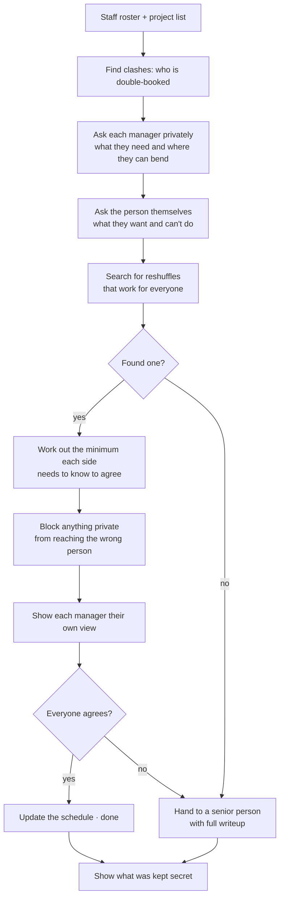
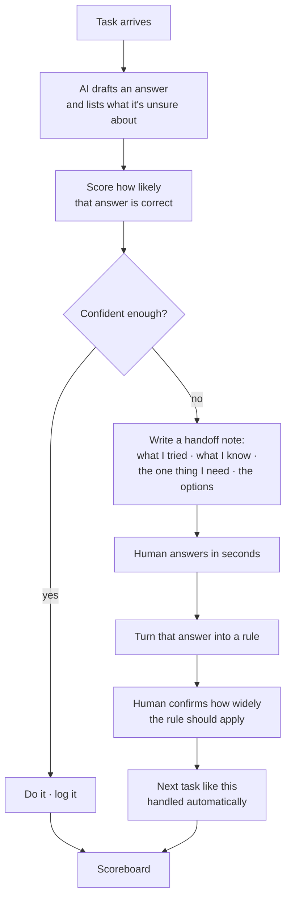
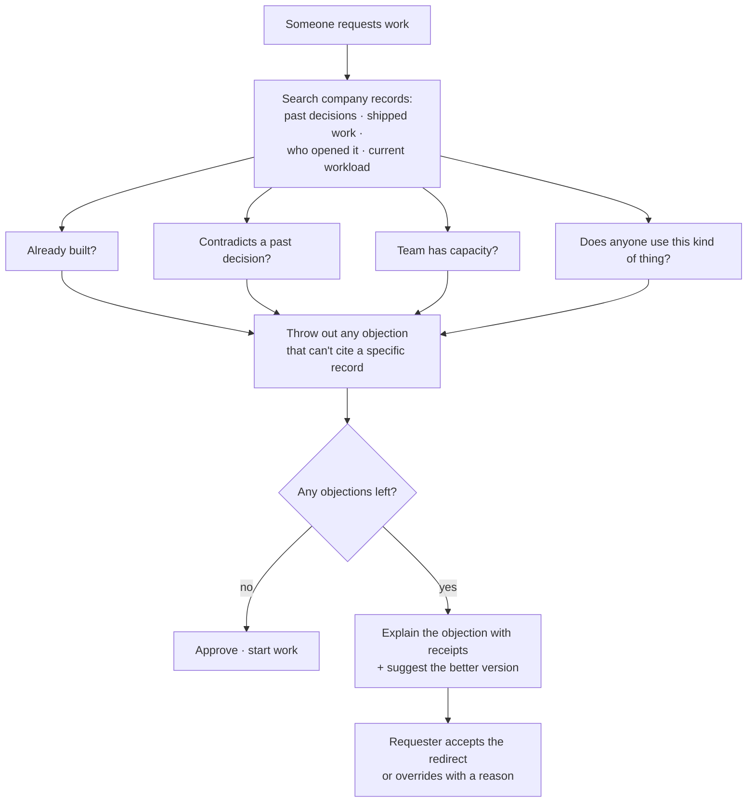
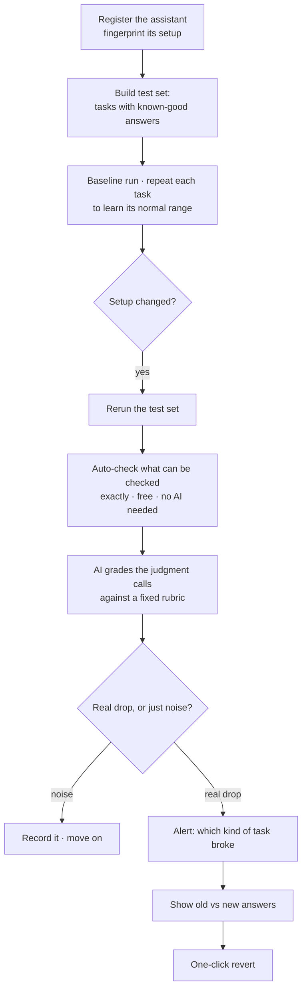

# August Wildcard — Project Notes

Four project options for the IBM SkillsBuild challenge, August Wildcard track ("Build Intelligent Systems for the Future of Work"). Due 31 August, 11:59 PM ET.

**Context in three lines.** I pulled every submission from the platform. July finished with 354 projects; August has 45 with a week to go — same prize money, far fewer competitors. Of 92 wildcard projects across both months, only 6 use IBM's own AI models. And nobody in the entire field measures whether their thing actually works.

So: pick a narrow problem, use IBM Granite, and put a real number on screen.

Four options below, then the pick at the end. Short version: we're building **BENCH**. Backup detail and the build spec are in the appendix.

---

# 1. BENCH

## What it does

Two project managers both need the same person during the same weeks. Both have real deadlines, and both are quietly holding back some slack they'd never admit to, because admitting it means losing the argument. BENCH talks to each side privately and asks the questions that surface that hidden slack — *is that deadline real or internal? what actually breaks if you get her two weeks later?* It then searches for a reshuffle that leaves everyone better off: swap in someone from the bench, split her time, slide a workstream into the float one side just revealed. When it finds one, it shows each manager only what they need to see to say yes — and it can prove it never leaked the other side's private information. If no good trade exists, it doesn't force one; it hands the whole thing to a senior person with a full writeup of what it tried and why each option failed.

## How it works



## Why it stands out

Every single one of the 92 projects in this field is a tool for one person. Not one of them handles a disagreement between people — which is what the challenge actually asks for when it says "help *teams* achieve outcomes faster."

The real idea here isn't the scheduling. It's that BENCH is trusted **because** it keeps secrets. It knows more than either manager and can demonstrate exactly what it chose not to say. The final screen shows every private fact it held, who it was hidden from, and whether revealing it would have changed their position. Nothing else in this competition has a moment like that.

It's also the easiest of the four to show in three minutes — real people, real conflict, an answer nobody at the table had spotted. And it's the most believable as a real product: IBM Consulting matches something like 160,000 people to projects, continuously. A judge from that side of the business will recognize the problem instantly.

---

# 2. RELAY

## What it does

An AI assistant works through a queue of real tasks — support tickets, refund requests, that kind of thing. Most of them it just handles. But on the ones where the rules are genuinely unclear, it stops instead of guessing. That's the whole point: an assistant that's confidently wrong even one time in twenty is useless for anything that matters, and guessing quietly is how that happens. When RELAY stops, it doesn't just dump the task on a person — it writes up what it tried, what it found, the *one* specific thing it needs to know, and the two or three ways this could go. A human answers in about ten seconds. RELAY then turns that answer into a rule, asks the human to confirm how widely it should apply, and handles the next task of that shape by itself.

## How it works



## Why it stands out

Nothing in this field treats the handoff as the product. There's one project about what an AI is *allowed* to do — permissions. This is about what it's *capable* of doing, which is a completely different question and an open one.

The number sells it: how often the assistant is confidently wrong, before and after. Something like 23% down to 4%. That's a real before-and-after in a competition where essentially nobody has one.

Two details make it credible rather than clever. The AI doesn't get to decide when to stop — a separate scoring step does that, so the thing that's bad at knowing its own limits isn't the thing judging its own limits. And when a human answers, RELAY asks how far that answer should generalize instead of assuming. One answer about one edge case silently becoming policy for a thousand unrelated tasks is exactly how these systems rot, and asking is the fix.

---

# 3. SPINE

## What it does

Work requests come in — build this dashboard, run this analysis, write this report. Before doing any of it, SPINE checks the request against what the company has already built, already decided, and already committed to. If someone asks for a dashboard that already exists and has been opened four times in two months, SPINE says so, shows the existing one and its usage numbers, and offers what it thinks the person actually wanted. If a request contradicts an architecture decision made three weeks ago, it points at the decision. If a team is asking for work they don't have the capacity for, it does the arithmetic and shows them. And when a request is perfectly fine, it approves it immediately and gets started. Every refusal has to point at a specific record — it can't decline because something merely *seems* redundant.

## How it works



## Why it stands out

Every other project in this competition builds something that says yes. This one says no.

That's not a gimmick — it's pointed at something real. Most wasted work is created at the moment it's *requested*, not while it's being done, and an eager assistant just makes the waste happen faster. The person who'd normally catch this is a senior someone with full context and the standing to push back, and every organization has too few of them.

The thing that keeps it from being an AI that's just argumentative: every objection has to cite a specific record — the existing dashboard, the view count, the decision, the capacity number. No receipts, no objection. That's enforced in the code, not requested in a prompt.

And the number to lead with isn't how many bad requests it caught. It's how many *good* requests it wrongly blocked. Something that refuses everything is trivially safe and completely worthless, and reporting the false-alarm rate first is how you show you know that.

---

# 4. WARD

## What it does

Companies are putting AI assistants into real workflows right now, and those assistants get tweaked constantly — someone edits the instructions, someone upgrades the model, someone rebuilds the search index. Every one of those is an untested change to something running in production, and when quality drops, nobody finds out until customers complain weeks later. WARD keeps a set of known test tasks with known-good answers. Whenever an assistant's setup changes, it reruns them — several times each, because these things give different answers on different runs and one comparison would just be noise. If quality genuinely drops, it says which *kind* of task broke, shows the old and new answers side by side, and offers a one-click revert.

## How it works



## Why it stands out

The blind spot in this whole field is that nobody proves their thing works. WARD's entire job is proving things work, which makes that argument for itself.

It's also a problem the judges personally have. They're IBM engineers who ship AI systems; they have been burned by exactly this.

And it's impossible to fake in a demo. Break something on purpose, watch it get caught, four minutes instead of three weeks. It either works on stage or it doesn't.

The hard part — and the part worth showing off — is telling a real drop from ordinary randomness. These assistants naturally give slightly different answers each time. Compare one run before to one run after and you get alerts constantly, everyone ignores them, and the whole thing is dead within a week. Running each task many times and only flagging drops that are genuinely outside the normal range is what makes it usable.

---

# The other two

**KEEL** — reads an old codebase alongside whatever history exists around it (commit messages, tickets, comments) and reconstructs *why* the weird bits are there, flagging what nobody can explain any more. Its most useful output is that list of unexplainable things — a map of knowledge the company has already lost. Best IBM fit of anything here, since mainframe modernization is a big IBM business with a retiring workforce. Parked because a convincing demo needs a real old system with real history, and faking that in a week shows.

**TWIN** — model a business process, then test a proposed change against replayed history before anyone commits to it. Highest ceiling of the six and the most impressive if it lands. Parked because it's honestly a three-week build, and a rushed version looks like a toy.

---

# The pick: BENCH

We're building BENCH. Four reasons, in order:

**It's the only idea in an empty room.** All 92 projects in this competition are tools for one person. Zero handle a disagreement between people. Everything else on this list is in a less crowded room than average — BENCH is in one nobody has walked into.

**The problem is instantly recognizable.** Two managers fighting over one person is something every judge has personally sat through. No setup required, no explaining why it matters. And at IBM Consulting's scale it's a core operational constraint, not a hypothetical.

**It has the best three minutes.** Real people, real conflict, an answer nobody at the table spotted — and then the closing shot of every secret it kept and who it kept it from. That last screen is the most memorable ten seconds available anywhere in this field.

**It's the safest build.** The scheduling search is ordinary code. The privacy filter is ordinary code. Granite handles the conversation and the explanations, which is the part it's actually good at. No research risk — RELAY and WARD both hinge on getting statistics right, and that's how you lose a week.

It also swallows the other ideas rather than competing with them. RELAY's handoff writeup is what BENCH does when there's no good trade. SPINE's cite-your-receipts rule is how BENCH turns down an unreasonable demand. We get the best of three ideas in one build.

**The one thing that would change this:** if either of us can point it at a real staffing process — a real team, a real schedule, a real argument. Proving it on something real instead of something seeded is exactly where every other project in this competition is weak, and it's the cheapest edge available to us.

**Next:** confirm how many of us there are and how many hours are actually real, then I'll write the build plan.

---
---

# Appendix

Everything below is backup detail. The section above is the decision; this is the evidence and the build spec.

## A. The field, in full

Pulled 24 August (day 24 of 31) from the challenge platform's own API, filtered per challenge tag and deduplicated. The platform's listing pages are unreliable — an unfiltered sweep returned 372 of a claimed 802 records with duplicates — so these counts come from per-tag queries run to exhaustion.

### Field size

| Month | Themed track | Wildcard | Total |
|---|---|---|---|
| July (final) | 275 | 79 | **354** |
| August (day 24) | 32 | 13 | **45** |

Same prizes every month. August is at roughly 13% of July's volume with a week left. Four prizes against a likely final field of 40–80 wildcard entries.

Also worth knowing: we can only submit to Wildcard once across both months, and we haven't used it. August Space has 32 entries already and is a harder domain to be credible in on short notice.

### Nobody uses IBM's own AI

Across all 92 wildcard projects, **6 mention watsonx or Granite** — 6.5%.

The judging criteria say "quality of implementation and effective use of AI **and IBM technologies**." It's an IBM panel, and 93% of the field is quietly calling someone else's model. Using Granite and saying so is close to free differentiation, and it's the clearest shot at Best Use of Technology, which has the smallest real field of the four prizes.

### What's already crowded

Avoid these entirely — entering caps the Innovation score no matter how well it's built.

| Cluster | Count | Examples |
|---|---|---|
| Meeting / knowledge capture | 12 | AncoraAI, Cadence, MindMesh, Atlas, Corpus |
| Student / career assistants | 10 | CareerPlot, Nexus AI, Acad-Nav, ClearPath |
| Generic "decision intelligence" | 10 | Cascade Intelligence, NexusFlow, AutoSage |
| Multi-agent orchestrator, unspecified | 10 | Chronos, ARL, OpsFlow, VoxDesk |
| Governance / audit / compliance | 6 | Mandate, SENTRY AI, Trace |

### Closest existing projects to ours

- **Mandate** (July) — controls what an AI agent is *allowed* to do. Permissions, not competence. Different axis from RELAY.
- **Beef** (July) — finds pairs of pull requests that pass alone but break together. Nothing to do with BENCH, but it's the sharpest project in the field and worth studying for how narrow a winning idea can be.
- **Shadow Ops** (July) — finds hidden work and measures wasted effort. Adjacent to SPINE.
- **MetaForge** (August) — writes testable prompts. Adjacent to WARD, but design-time rather than runtime.
- **RESONANCE** (August) — organizational history as intelligence. Adjacent to KEEL.

Nothing is close to BENCH.

### The gap everyone leaves open

Across all 92 projects: no benchmarks, no before-and-after numbers, no real users, no evidence. Everyone claims outcomes. Nobody shows one. A single honest measured number is the cheapest edge available to us.

---

## B. BENCH build spec

### Roles

| Who | What they do |
|---|---|
| Resource manager | Runs it, sees everything |
| Project manager (2+) | States needs privately, accepts or counters proposals |
| The person being scheduled | States their own constraints and what they want to work on |
| Senior lead | Gets the escalation when there's no good trade |

### Data

```
Person       skills · current bookings by week · what they want to work on
             location · cost

Project      client · priority · money at risk
             workstreams (skills needed, weeks, how critical)
             hard deadline · slack weeks  ← PRIVATE

Constraint   who it belongs to · hard or soft · how much it matters
             visibility: private | shareable | already shared
             what they said · what we parsed it into

Proposal     the reshuffle · score · per-person view of it
             what was disclosed to whom, and on what authority
```

The visibility flag and the disclosure record are the whole product. Everything else is ordinary scheduling data.

### Where the work splits

| Ordinary code | Granite |
|---|---|
| Finding who's double-booked | Turning what people type into structured constraints |
| Searching for workable reshuffles | Asking the follow-up questions that surface hidden slack |
| Blocking private facts from reaching the wrong person | Writing the explanation each manager sees |
| Scoring how good a reshuffle is | Writing the escalation note |

The split matters and is worth saying out loud in the video. The search has to be ordinary code because the whole thing collapses if a proposed trade turns out not to actually work — that's a guarantee, and a language model can't give one. The privacy filter has to be ordinary code for the same reason: "we told the model not to leak" isn't a safeguard. Granite does the parts it's genuinely good at, which is talking to people and explaining things.

The privacy filter specifically: Granite writes the explanation, then code checks every claim in it against what that person is allowed to know. Anything referencing a private fact gets thrown out and rewritten. Fails twice, the proposal ships without an explanation rather than with a leaky one.

### The reshuffles it can try

Swap in someone else from the bench · split the person across both projects · slide a workstream into slack one side revealed · reorder workstreams within a project · any combination.

It returns several workable options rather than one answer, and the resource manager picks.

### What we measure

Forty made-up but realistic clashes where we've worked out the best possible answer in advance.

| Metric | Baseline | Target |
|---|---|---|
| How good the outcome is vs. the best possible | First-come-first-served: ~55%<br/>Loudest-manager-wins: ~62% | 85%+ |
| Settled without escalating | — | 70%+ |
| **Private facts leaked** | — | **0 — a test fails the build if any leak** |

That last one is a hard assertion in the test suite, not an average. One leak breaks the build. That's the difference between claiming it's private and proving it.

### Rough build order

| Piece | Days |
|---|---|
| Data model + generating the fake org | 1 |
| The reshuffle search | 1 |
| Granite: asking questions, writing explanations | 1 |
| Privacy filter + disclosure record | 1 |
| Screens (clash list, private intake, proposal, the secrets panel) | 2 |
| Test harness + video | 1 |

### Video, three minutes

1. Three-way clash on screen, both deadlines real
2. Each manager privately says what they need — including slack they'd never say out loud
3. BENCH proposes the trade
4. Both accept. Outcome 34% better than first-come-first-served
5. **The secrets panel** — everything it knew and deliberately didn't say
6. A fourth clash with no good answer → escalates with a full writeup instead of forcing it

---

## C. Admin — don't lose on a technicality

- [ ] Claim IBM Bob — 40 Bobcoins, 30-day clock starts when activated
- [ ] **Both of us** complete one SkillsBuild Bob learning activity — hard eligibility requirement, this is what kills submissions
- [ ] Create the project page on the platform early, don't discover a submission bug on the 31st
- [ ] Public GitHub repo, README covering: problem, solution, AI approach and architecture, challenge theme, **how IBM Bob was used**
- [ ] Keep a running `bob-log.md` as we build — that README section is scored and most teams write three sentences for it
- [ ] Video under 3 minutes, publicly accessible, no login required
